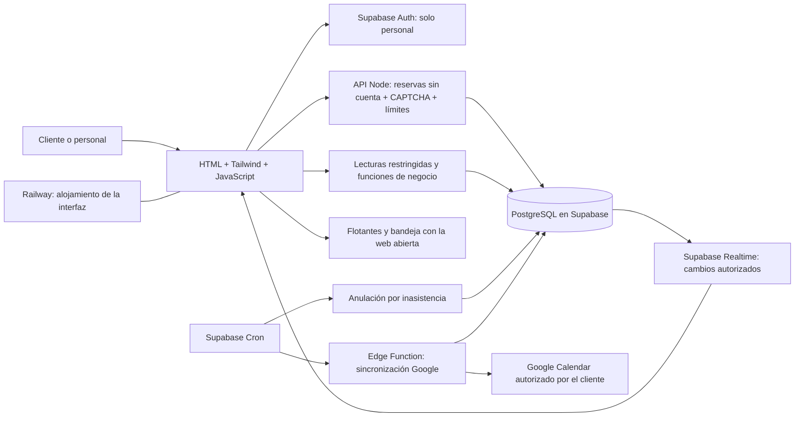

# 03 — Arquitectura y seguridad

Estado: propuesta técnica para un local, pendiente de confirmar reglas del negocio. No se han creado servicios externos.

## Arquitectura propuesta



| Capa | Responsabilidad |
| --- | --- |
| HTML | Estructura semántica, formularios y navegación. |
| Tailwind CSS | Diseño responsive y tokens de color. |
| JavaScript modular | Estado de pantallas, validación de ayuda, calendario, gráficos y cliente Supabase. |
| Vite, propuesto | Desarrollo local y compilación de archivos estáticos. |
| Supabase Auth | Identidad y sesión únicamente de los dos administradores y los dos peluqueros. |
| API Node `/api/public` | Contacto obligatorio, CAPTCHA validado, límites y acceso privado por reserva; clave privilegiada solo en servidor. |
| PostgreSQL | Persistencia, reglas transaccionales, restricciones y agregación de ventas. |
| Funciones SQL / RPC | Operaciones atómicas de agenda y cobro con autorización explícita. |
| Notificaciones en PostgreSQL | Avisos con destinatario, fecha de vigencia y lectura; consultas autenticadas. |
| Supabase Realtime, propuesto | Actualizaciones de avisos; complementar con consulta periódica mientras la web esté visible. |
| Supabase Cron, propuesto | Normalizar reservas vencidas sin llegada y activar el procesador de Google Calendar. |
| Edge Functions, propuestas | OAuth y llamadas a Google Calendar con secretos de servidor. |
| Railway | Servir la interfaz compilada bajo HTTPS. |

La integración Tailwind/Vite tiene soporte documentado; las versiones se fijarán al iniciar el código y se conservará el archivo de dependencias bloqueadas. Véase [instalación oficial](https://tailwindcss.com/docs/installation/using-vite). No depender de un CDN de desarrollo para el CSS de producción.

## Estructura objetivo

La estructura ejecutable inicial ya existe. Esta propuesta describe también módulos futuros; ver el [estado real de implementación](14-estado-de-implementacion.md).

```text
/
  README.md
  AGENTS.md
  docs/
  index.html
  package.json
  package-lock.json
  .env.example
  .gitignore
  public/
  src/
    styles/
    components/
    pages/
    services/
    lib/
    main.js
  supabase/
    migrations/
    functions/
    seed.sql
  tests/
```

Separar componentes visuales de servicios de API y reglas de formato. El servidor es la fuente de verdad para permisos, disponibilidad, precios, totales y vigencia de notificaciones. Los datos de muestra de `seed.sql` serán solo de desarrollo. Los flotantes no requieren proveedor ni proceso de envío; sí se agrega trabajo de servidor para la anulación por inasistencia y para Google Calendar. Ver [notificaciones](06-recordatorios.md) y [Google Calendar](12-google-calendar.md). Supabase permite programar funciones SQL y otros trabajos con [Cron](https://supabase.com/docs/guides/cron).

## Identidad y roles

D09 confirmado: clientes sin cuenta ni contraseña, sin usuarios Auth anónimos. Nombre, celular y correo obligatorios por reserva. Contactos no verificados no autorizan acceso a datos. Un enlace privado con token aleatorio de 256 bits permite ver/cancelar una sola reserva; la base guarda únicamente su hash. El backend valida CAPTCHA y límites antes de crear citas. Desactivar nuevas inscripciones y acceso anónimo en Supabase Auth. Ver [15](15-reservas-sin-cuenta.md).

El administrador inicial se provisiona por un procedimiento controlado de operación. Los roles se guardan en una tabla protegida; no se toman de campos que el usuario pueda editar ni de una bandera en el navegador. Desactivar el acceso de un trabajador debe ser efectivo en el servidor.

Equipo confirmado: dos peluqueros y dos administradores. Los peluqueros necesitan acceso individual para avisos y descansos; vincular cada cuenta a `professionals`. Limitar por defecto su operación a la agenda asignada. La autorización para cobros por peluquero sigue pendiente; por defecto los administradores registran el pago. No asignar privilegios administrativos a los peluqueros.

Un registro presencial puede existir sin cuenta. No asociar automáticamente un historial a una nueva cuenta solo porque coincida el teléfono escrito; verificar identidad o realizar vinculación administrativa auditada.

## Matriz mínima de acceso

| Recurso | Visitante | Cliente | Peluquero | Administrador |
| --- | --- | --- | --- | --- |
| Catálogo público y horas libres | Lectura filtrada | Lectura filtrada | Lectura | Gestionar |
| Datos de contacto | Ninguno | No hay perfil ni historial por contacto | Solo los de su agenda | Gestionar citas |
| Citas y llegada | Crear por gateway protegido | Una cita por enlace privado; cancelar hasta 30 min antes | Agenda asignada y llegada dentro de tolerancia | Todas; llegada y gestión según política |
| Atenciones y ventas | Ninguno | Sin acceso en el MVP | Sus atenciones; cobro solo si se habilita | Registrar cobros, consultar y anular con motivo |
| Dashboard global | Ninguno | Ninguno | No, salvo decisión D10 | Sí |
| Horarios, precios y roles | Ninguno | Ninguno | Lectura operativa | Gestionar |
| Bloqueos de descanso | Ninguno | Ninguno | Crear/editar/retirar los de su agenda | Gestionar todas las agendas |
| Notificaciones internas | Ninguno | Ninguno | Solo destinatario propio; propuesta: citas asignadas | Destinatario de avisos de todas las citas |
| Conexión Google Calendar | Ninguno | Conectar/desconectar la propia; solo sus citas | Ninguno | No acceder a conexiones ni tokens de clientes |
| Auditoría | Ninguno | Ninguno | Sin modificación | Lectura; sin edición |

La disponibilidad pública devuelve horas libres, nunca nombres, contactos, motivos de bloqueo ni el listado completo de citas.

## Controles de seguridad obligatorios

1. Activar RLS en tablas expuestas y limitar también permisos de tablas y funciones. Supabase documenta el uso conjunto de permisos y políticas; una política no sustituye la revisión de permisos. Fuente: [RLS en Supabase](https://supabase.com/docs/guides/database/postgres/row-level-security).
2. Para agenda, cobros y roles, denegar escrituras directas desde el cliente y utilizar operaciones controladas.
3. Las funciones privilegiadas deben comprobar identidad y rol, fijar un `search_path` seguro, calificar los objetos usados y restringir quién puede ejecutarlas. No confiar en `customer_id`, `role`, precio o total recibidos como prueba de autorización.
4. Limitar el acceso a columnas sensibles: una lectura pública del negocio no debe revelar configuración interna. Usar proyecciones o funciones con respuestas explícitas.
5. Mantener secretos de Supabase únicamente en el servidor. La clave pública del cliente no concede permisos por sí sola; la seguridad depende de las políticas. No se necesitan claves de mensajería para los flotantes internos.
6. Validar tamaño, formato y contenido de entradas. Mostrar texto del usuario sin interpretarlo como HTML. Evitar registrar contactos completos, tokens o mensajes completos en logs.
7. Limitar abuso de autenticación y reserva por identidad y origen; evaluar CAPTCHA según D09 y el proveedor. No usar la dirección IP como identidad única.
8. Las consultas de reportes también requieren autorización, incluso si solo devuelven agregados. Las vistas no deben permitir eludir las políticas base.
9. Separar ambientes de prueba y producción, incluyendo destinatarios, credenciales y acceso al proyecto.
10. Registrar quién cambió precios, horarios, citas y ventas, con fecha y motivo cuando corresponda.
11. Scheduler y procesador Google invocan operaciones privilegiadas mediante autenticación de servidor; no exponer una función pública que permita ejecutar tareas arbitrarias. Compartir bloqueo transaccional entre llegada, vencimiento, descanso y reserva.
12. OAuth Google requiere validación de retorno y `state`, secretos cifrados fuera de esquemas expuestos y autorización independiente del login. Nunca usar el calendario personal del cliente como fuente de disponibilidad del negocio.

## Variables previstas

| Variable ilustrativa | Dónde | Secreta |
| --- | --- | --- |
| `VITE_SUPABASE_URL` | Compilación de interfaz | No |
| `VITE_SUPABASE_PUBLISHABLE_KEY` | Compilación de interfaz | No; permisos limitados por diseño |
| Clave privilegiada de Supabase, según entorno | Funciones de servidor, si se necesita | Sí |
| `APP_BASE_URL` | Servidor; enlaces de confirmación | No |
| `GOOGLE_CLIENT_ID` | Configuración OAuth | Identificador público, no otorga acceso por sí mismo |
| `GOOGLE_CLIENT_SECRET` | Servidor OAuth | Sí |
| `GOOGLE_REDIRECT_URI` | Servidor y configuración Google | No |
| `CALENDAR_TOKEN_ENCRYPTION_KEY` | Gestor de secretos del servidor | Sí |
| `CALENDAR_WORKER_SECRET` | Scheduler y procesador de sincronización | Sí |

En Vite las variables con prefijo `VITE_` se incorporan al código del cliente; jamás usar ese prefijo para secretos. Fuente: [variables de entorno de Vite](https://vite.dev/guide/env-and-mode). Horarios y precios son configuración del negocio en la base de datos, no variables de entorno.

## Operación y privacidad

Recopilar solo datos necesarios para atender y recordar la cita; no pedir identificación nacional ni información sensible sin necesidad definida. Determinar con el dueño país de operación, aviso de privacidad, plazos de conservación y quién atiende solicitudes sobre datos. Estos documentos no constituyen una evaluación de cumplimiento legal.

Definir respaldos y comprobar una restauración antes del lanzamiento. No prometer retención o recuperación que el plan contratado no incluya. Proponer alertas por fallo de reservas, ejecución atrasada de vencimientos y errores de sincronización de avisos o Google. Usar identificadores de solicitud y logs sin tokens. Los flotantes no producen notificaciones fuera de la web cuando está cerrada; el vencimiento por inasistencia y los trabajos de Google sí se ejecutan en servidor sin depender del navegador.
