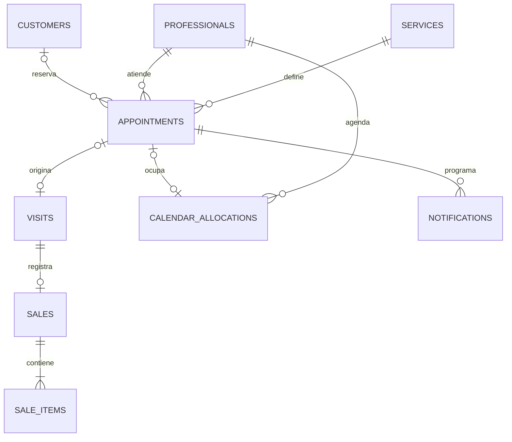

# 04 — Modelo de datos y contratos

**Actualización v0.2:** se añade `customers.email` y esquema privado `guest_access` / `guest_rate_limits` mediante migración 004. Los invitados no tienen `auth_user_id`; los contactos no se fusionan por correo/celular no verificado. La tabla de clientes sigue siendo necesaria para registrar la cita, sin crear cuentas Auth. Contrato vigente y acceso por enlace: [15](15-reservas-sin-cuenta.md).

Modelo lógico propuesto para Supabase/PostgreSQL, v0.3 del 31 de agosto de 2026. No contiene migraciones ejecutadas. Incluye llegada, vencimiento, descansos y sincronización opcional Google. Datos confirmados y propuestas de bloques 45/50/50/60 minutos en la [ficha del negocio](11-ficha-del-negocio.md); revisar D03–D09, D11 y D16 antes de cerrar contratos.

## Convenciones

- Identificadores UUID y claves foráneas explícitas.
- Eventos como `timestamptz`; jornadas semanales como hora local junto a la zona IANA del negocio.
- `created_at` representa el registro; `sold_at` representa el cobro. No intercambiarlos.
- Dinero con `numeric(12,2)` y moneda `USD` confirmada. Nunca `float` para importes.
- Duraciones y márgenes como enteros en minutos. Copias históricas al reservar y vender.
- Desactivar catálogo y personal conservando referencias. Prohibir eliminaciones en cascada de ventas e historial operativo.

## Entidades

| Tabla | Campos principales | Reglas |
| --- | --- | --- |
| `business_settings` | `id`, nombre, dirección, zona, moneda, `slot_step_minutes`, anticipación, horizonte, `cancellation_notice_minutes`, `arrival_grace_minutes`, `arrival_recommendation`, `booking_enabled` | Configurar 30 minutos de cancelación y 5 de tolerancia; publicar solo campos apropiados. |
| `user_roles` | `user_id` → Auth, `role`, `active` | Roles `barber`, `admin`; solo tres cuentas del personal, escritura privilegiada. Los clientes no tienen rol Auth. |
| `customers` | `id`, `auth_user_id` nullable y único, nombre, teléfono, correo | Reserva online y cliente presencial sin cuenta; contactos no públicos y sin fusión automática por coincidencias. |
| `professionals` | `id`, nombre visible, `auth_user_id` único, `active` | Dos peluqueros con cuentas vinculadas para avisos y descansos. Capacidad propuesta de uno; administrador no es un tercer recurso. |
| `services` | `id`, nombre, descripción, `price`, `estimated_min_minutes`, `estimated_max_minutes`, `duration_minutes`, `buffer_minutes`, `active` | Precio no negativo, estimación mínima positiva y máxima >= mínima; bloque propuesto igual al máximo. Margen >= 0. |
| `professional_services` | `professional_id`, `service_id` | Pareja única que define qué puede realizar cada profesional. |
| `working_intervals` | `id`, `professional_id` nullable, día de semana, hora inicio/fin | `NULL` identifica apertura del local; varias franjas por día, sin cruces en el mismo ámbito. |
| `schedule_exceptions` | `id`, `professional_id` nullable, `local_date`, `intervals`, motivo | Una excepción por ámbito y fecha; lista vacía significa cierre. Validar cada franja y su orden. |
| `appointments` | `id`, `customer_id` nullable, `professional_id`, `service_id`, `starts_at`, `ends_at`, `occupied_until`, `status`, `origin`, `schedule_version`, `revision`, `checked_in_at`, `checked_in_by`, `cancellation_deadline`, `arrival_deadline`, precio/duración/margen copiados, `created_by` | Estados incluyen `checked_in` y `no_show`; fechas límite copiadas al reservar y recalculadas al reprogramar. `revision` sube en cada cambio relevante, incluso cancelación. |
| `calendar_allocations` | `id`, `professional_id`, `appointment_id` nullable y único, `kind`, `starts_at`, `ends_at`, `active`, motivo privado, `created_by`, `updated_by` | `kind`: cita o descanso. Peluquero gestiona solo sus bloqueos; admin cualquiera. No superposición por profesional. |
| `appointment_events` | `id`, `appointment_id`, tipo, actor, fecha, cambios, motivo | Historial inmutable de creación, cambios y estados. |
| `visits` | `id`, `appointment_id` nullable y único, `customer_id` nullable, `professional_id`, `origin`, `started_at`, `completed_at`, `status`, `recorded_by`, motivo retrospectivo | `origin`: `appointment`, `walk_in` o `retrospective`; estados `in_progress`, `completed`. |
| `sales` | `id`, `visit_id` único, `sold_at`, `currency`, `total_amount`, `payment_method`, `status`, `created_by`, `voided_at`, `voided_by`, `void_reason` | USD; `payment_method`: `cash`, `bank_transfer`, `deuna`, registrados manualmente. Estados `posted`, `voided`; una venta por atención. |
| `sale_items` | `id`, `sale_id`, `service_id`, `service_name_snapshot`, `quantity`, `unit_price`, `line_total` | Precio y nombre históricos; cantidad entera positiva. |
| `notification_rules` | `id`, audiencia, `lead_minutes`, `enabled` | Audiencia: peluqueros y administrador. Propuesta: asignado + admin. Anticipación pendiente; no generar flotantes para clientes. |
| `notifications` | `id`, `recipient_user_id` → Auth, `appointment_id`, `schedule_version`, tipo, `lead_minutes`, `visible_from`, `expires_at`, `status`, `first_presented_at`, `read_at`, `dismissed_at`, `claim_until`, `claim_token` | Aviso interno; unicidad por destinatario/cita/versión/tipo/anticipación. Estados `active`, `invalidated`. Solo servidor crea y modifica contenido/programación. |
| `request_deduplication` | actor, operación, `idempotency_key`, resumen del contenido, referencia al resultado, fecha | Unicidad por actor + operación + clave; no reutilizar una clave para otra solicitud. |
| `audit_log` | `id`, actor, acción, entidad, referencia, fecha, cambios permitidos, motivo | Solo servidor agrega; sin edición desde la aplicación. |
| `calendar_connections` — privada | `id`, `appointment_id`, identidad Google de OAuth, calendario destino, tokens cifrados, estado | Conexión voluntaria del cliente; secretos inaccesibles por Data API y Realtime. |
| `appointment_calendar_links` | `id`, `appointment_id`, `user_id`, `connection_id`, `external_event_id`, `last_synced_revision`, estado | Un vínculo por cita/conexión; exponer solo resultado reducido al dueño de la cita. |
| `calendar_sync_jobs` — privada | `id`, `link_id`, `desired_revision`, estado, intentos, `next_attempt_at`, `locked_until`, error sanitizado | Cola transaccional, unicidad por vínculo/revisión; procesador revalida estado actual. |

La sintaxis SQL final debe garantizar unicidad con ámbitos nulos en jornadas/excepciones, mediante índices apropiados o una clave explícita de ámbito. No asumir que una restricción `UNIQUE` ordinaria trata dos `NULL` como el mismo local.

## Relaciones esenciales

Una atención retrospectiva puede no tener cita. Un bloqueo de agenda no tiene cita. Una cita cancelada puede no tener atención. El servidor verifica coherencia entre cliente, profesional y origen al vincular registros; no basta con que los UUID existan.

Las notificaciones pertenecen a las cuentas Auth del peluquero asignado y administrador según la distribución propuesta en D11. No se generan para clientes. Validar destinatario, rol activo y acceso vigente a la cita al consultar o reconocer avisos. La vinculación Google del cliente es independiente de las bandejas internas; nunca publicar tablas privadas de tokens/trabajos en Realtime.

## Disponibilidad y concurrencia

Diseño propuesto: centralizar citas y bloqueos puntuales en `calendar_allocations`. La exclusión GiST sobre `professional_id` y `tstzrange(starts_at, ends_at, '[)')`, limitada a filas activas, impide intervalos cruzados. PostgreSQL documenta restricciones de exclusión para rangos y su combinación con identificadores usando `btree_gist`: [referencia oficial](https://www.postgresql.org/docs/current/rangetypes.html#RANGETYPES-CONSTRAINT).

Además de la exclusión, todas las operaciones que cambian agenda o disponibilidad adquieren un mismo bloqueo transaccional del local antes de releer configuración y validar. Para este MVP pequeño, serializar estas escrituras es una propuesta sencilla y verificable. Incluye reserva, reprogramación, walk-in, bloqueos, cambios de horario, duración reservada y activación del personal. Las lecturas públicas no requieren dicho bloqueo.

Llegada y vencimiento también usan este protocolo. La consulta pública puede invocar primero una normalización controlada de citas vencidas en servidor; esa fase sí toma el bloqueo, luego devuelve solo horas libres. `server_now > arrival_deadline` con estado `confirmed` y sin llegada implica inasistencia efectiva; liberar la ocupación y encolar cancelación Google en la misma transacción. `checked_in` excluye vencimiento por ausencia. Un registro de llegada no puede ser retroactivo ni provenir del cliente público. Los cambios de política no reescriben plazos de citas existentes sin una operación explícita y auditada.

La exclusión protege ocupaciones; el protocolo transaccional protege también cambios de jornada concurrentes. Crear un cierre global debe validar y bloquear las agendas afectadas en la misma operación. No cambiar horarios por escrituras directas que evadan este protocolo.

Al cancelar se desactiva la ocupación; al reprogramar se actualiza dentro de la transacción. Completar conserva la ocupación histórica. `occupied_until` de una cita coincide con el fin de su ocupación. Cualquier ampliación debe revalidarse; no liberar prematuramente el intervalo por marcar una atención completada.

## Integridad monetaria

- El servidor selecciona los precios del catálogo o la cotización histórica autorizada. El navegador no determina el total definitivo.
- `line_total = quantity × unit_price`; `total_amount = suma de line_total` en una transacción. El cobro usa un solo medio de pago en el MVP propuesto.
- La venta requiere una atención completada, o completarla en esa misma transacción. `sold_at` no puede estar en el futuro; cambios retrospectivos requieren permiso y motivo.
- Una atención completada sin venta aparece como pendiente de cobro. No generar una venta ficticia con valor cero para cerrar ese pendiente.
- `UNIQUE(visit_id)` e idempotencia impiden doble venta por doble clic o reintento.
- Las líneas de una venta `posted` son inmutables. Anular exige rol de administrador y motivo; no elimina la atención ni sus eventos.
- Para el MVP, una venta anulada no puede sustituirse por otra sobre la misma atención sin un procedimiento de corrección diseñado expresamente. No saltarse la unicidad creando atenciones ficticias. Resolver necesidad de corrección en D08.

## Contratos propuestos del servidor

Contrato conceptual: los nombres definitivos de esta primera versión están en `supabase/migrations/202608310002_operations.sql`. Ver las diferencias y módulos pendientes en [14 — Estado de implementación](14-estado-de-implementacion.md). Las escrituras compuestas deben terminar en una única transacción PostgreSQL; varias llamadas consecutivas desde el navegador no equivalen a una transacción.

| Operación | Entrada principal | Comportamiento / salida |
| --- | --- | --- |
| `get_available_slots` | servicio, fecha local, profesional opcional | Horas libres sin información de otras personas; límite de rango. |
| `create_booking` | servicio, profesional opcional, inicio, clave de idempotencia | Deriva cliente de sesión, asigna un profesional real, revalida y crea cita, ocupación y notificaciones configuradas. |
| `reschedule_booking` | cita propia o gestionable, nuevo inicio, versión esperada, clave | Mueve todo atómicamente; conflicto conserva la reserva anterior. |
| `cancel_booking` | cita, versión esperada, motivo, clave | Comprueba propietario/rol y límite de 30 min en servidor; libera ocupación, invalida avisos y encola cancelación Google si hay vínculo. |
| `check_in_appointment` | cita, clave | Peluquero asignado/admin registra llegada con reloj del servidor dentro de tolerancia; estado `checked_in`. |
| `expire_no_shows` | ejecución de servidor | Normaliza vencidas sin llegada, libera ocupaciones, invalida avisos y encola retiro Google; no RPC abierta al cliente. |
| `start_visit` | cita, clave | Requiere llegada válida o la registra atómicamente dentro del plazo; crea atención única. |
| `finish_visit` | atención, hora final, clave | Marca servicio realizado sin afirmar que ya se cobró. |
| `register_walk_in` | profesional, servicio, cliente opcional, clave | Personal autorizado; valida intervalo desde ahora, aunque no coincida con la cuadrícula pública. |
| `register_sale` | atención, líneas de servicios, medio de pago, clave | Calcula precios, completa si corresponde y guarda venta + líneas + auditoría. |
| `register_past_visit_and_sale` | fecha real, profesional, servicios, pago, motivo, clave | Solo personal autorizado; no modifica el calendario actual. |
| `void_sale` | venta, motivo, clave | Solo administrador; conserva historial y cambia estado. |
| `set_schedule` | ámbito, intervalos o excepción, versión esperada | Valida citas futuras antes de aplicar cambios. |
| `manage_break` | crear/editar/retirar, intervalo, profesional, motivo, clave | Peluquero solo su agenda; admin cualquiera. Valida conflictos y audita sin alterar reservas silenciosamente. |
| `get_sales_dashboard` | inicio y fin locales, agrupación | Solo rol permitido; devuelve totales y series consistentes con las reglas. |
| `get_my_notifications` | paginación, filtro de bandeja | Deriva destinatario de sesión y hora del servidor; devuelve solo avisos autorizados. Para flotantes, solo activos dentro de vigencia y cita vigente. |
| `claim_notification` | aviso | Reclama atómicamente una concesión temporal si aún corresponde mostrarlo y no fue presentado; devuelve token propio. |
| `ack_notification` | aviso, acción, token si confirma presentación | Registra presentación tras renderizado, lectura o cierre explícitos; no permite modificar contenido ni programación. |
| `connect_google_calendar` / `disconnect_google_calendar` | enlace privado de la reserva y flujo OAuth temporal | Gestiona autorización voluntaria y secretos solo en servidor. |
| `sync_appointment_to_google` | cita propia, conexión, clave | Verifica propiedad y encola trabajo; devuelve pendiente/estado, no éxito ficticio de Google. |

La versión esperada detecta edición desde dos pantallas. La clave de idempotencia se guarda junto a la operación y su resultado, con restricción única: un reintento idéntico devuelve el mismo resultado, uno con contenido distinto se rechaza. No usar solo un botón deshabilitado para evitar duplicados.

`schedule_version` aumenta al cambiar hora, profesional o duración reservada; `revision` aumenta también en cancelación/inasistencia y otros cambios que afectan el evento Google. Guardar las versiones y sus trabajos relacionados atómicamente para que un cambio tardío no regenere recordatorios o eventos obsoletos.

Errores estables propuestos: `SLOT_UNAVAILABLE`, `OUTSIDE_WORKING_HOURS`, `BOOKING_POLICY_VIOLATION`, `NOT_AUTHORIZED`, `STALE_VERSION`, `INVALID_INPUT` e `IDEMPOTENCY_CONFLICT`. Traducirlos a español en la interfaz sin exponer detalles internos de SQL.

## Índices, migraciones y comprobación

Preparar índices de citas por profesional/inicio y cliente/inicio, ventas por estado/fecha, notificaciones por destinatario/estado/vigencia y eventos por entidad/fecha. Confirmar su utilidad con consultas reales antes de optimizar de más.

Versionar tablas, restricciones, funciones, políticas, índices, configuración Realtime y tareas Cron. La red de Google se procesa fuera de las transacciones de agenda; revisar [contrato de integración](12-google-calendar.md). Probar instalación desde cero en un entorno aislado. Usar migraciones compatibles con la versión anterior cuando haya producción. Los respaldos no justifican perder historial mediante una migración destructiva.
